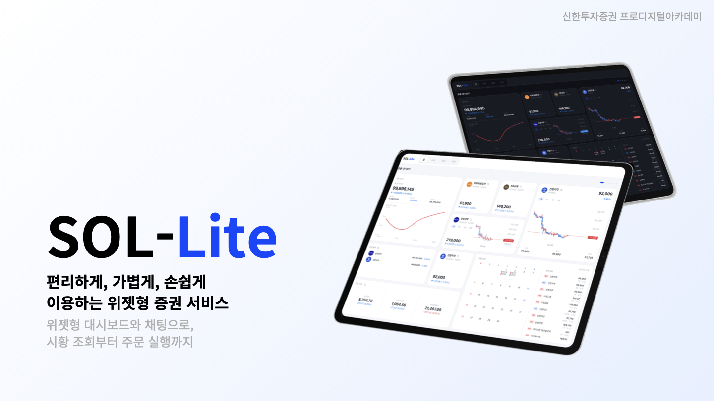
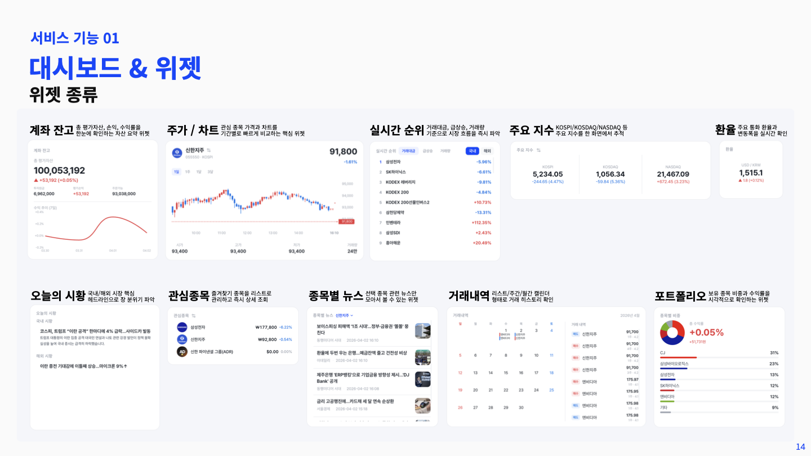
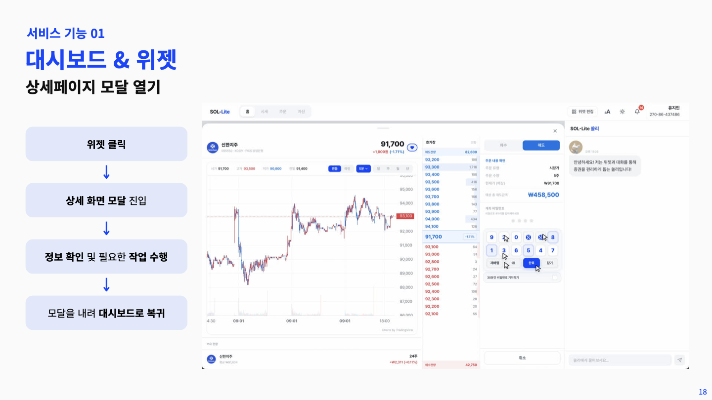
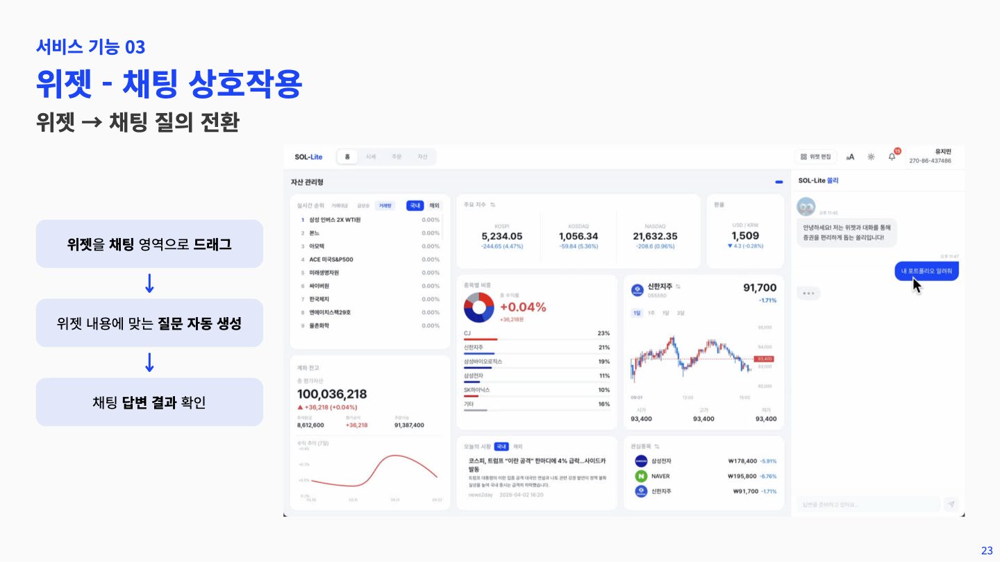

# SOL-Lite Frontend

> 편리하게, 가볍게, 손쉽게 이용하는 **위젯형 증권 서비스**  
> 위젯형 대시보드와 AI 채팅으로, 시황 조회부터 주문 실행까지 한 화면에서

신한투자증권 프로디지털아카데미 중간 프로젝트 — SOL-Lite의 프론트엔드 저장소입니다.



---

## 기획 배경

기존 증권 서비스는 정보와 기능이 분산되어, 원하는 것을 찾고 결정을 내리기까지 불필요한 탐색 과정이 반복됩니다. SOL-Lite는 이 문제를 세 가지 방향으로 해결합니다.

| 핵심 기능 | 설명 |
|---|---|
| **위젯형 대시보드** | 내가 원하는 정보만, 내가 원하는 자리에 — 10종 위젯, 자유로운 크기 및 배치 |
| **AI 챗봇** | 자연어로 시세 조회, 매매 주문, 환전, 포트폴리오 분석을 한 번에 |
| **위젯 ↔ 채팅 상호작용** | 위젯을 채팅으로 드래그하면 자동 질의 생성 / 채팅 답변 카드를 대시보드에 위젯으로 추가 |

---

## 주요 기능

### 대시보드 & 위젯



- **10종 위젯**: 계좌 잔고, 주가/차트, 실시간 순위, 주요 지수, 환율, 오늘의 시황, 관심종목, 종목별 뉴스, 거래내역, 포트폴리오
- **자유 배치**: Drag & Drop으로 위젯 이동 · 크기 변경 · 충돌 시 자동 재배치 (Push-aside 알고리즘)
- **다중 페이지**: 목적별 대시보드 페이지를 여러 개 구성하고 저장
- **프리셋**: 종합형 · 자산 관리형 · 시황 뉴스형 · 거래 분석형 · 차트 집중형 등 섹터 기반 프리셋 제공
- **위젯 상세 모달**: 위젯 클릭 시 바텀 시트로 상세 정보 확인 및 작업 수행



### AI 챗봇


- 잔고 · 종목 순위 · 환율 즉시 조회
- 대화형 매매 주문 및 환전
- 포트폴리오 구성 · 수익 · 리스크 분석
- 채팅 자동완성으로 위젯 상세 페이지 빠른 이동



---

## 기술 스택

| 분류 | 기술 |
|---|---|
| **UI** | React 19, Tailwind CSS v4 |
| **상태 관리** | Zustand (전역 UI 상태), TanStack Query (서버 상태) |
| **폼 & 검증** | React Hook Form, Zod |
| **차트** | lightweight-charts (TradingView), ECharts |
| **Drag & Drop** | @dnd-kit/core, @dnd-kit/sortable |
| **실시간** | STOMP over WebSocket (@stomp/stompjs) |
| **빌드** | Vite 8 |

---

## 개발 명령어

```bash
pnpm dev        # 개발 서버 시작
pnpm build      # 프로덕션 빌드
pnpm lint       # ESLint 검사
pnpm preview    # 프로덕션 빌드 미리보기
```

### 프록시 설정 (vite.config.js)

| 경로 | 대상 |
|---|---|
| `/api` | Spring 백엔드 — `localhost:8080` |
| `/ws` | WebSocket — `localhost:8080` |
| `/chat` | Python AI 서버 — `localhost:8000` |

---

## 패키지 구조

```
src/
├── pages/          # 라우트 진입점
│   └── auth/
├── components/     # UI 렌더링 담당
│   ├── ui/         # 공통 원자 컴포넌트
│   ├── layout/     # 전역 레이아웃 (AppShell, AppHeader, ChatPanel)
│   ├── widgets/    # 위젯 시스템
│   │   └── detail/ # 위젯 상세 모달 내용
│   ├── invest/     # 주문 페이지 컴포넌트
│   │   └── panels/
│   ├── market/     # 시세 페이지 컴포넌트
│   ├── asset/      # 자산 페이지 컴포넌트
│   ├── auth/       # 인증 관련 컴포넌트
│   └── signup/     # 회원가입 플로우 컴포넌트
├── features/       # 도메인별 비즈니스 로직 (hooks + 데이터 변환)
│   ├── market/     # 시세 · 지수 · 뉴스 데이터 훅
│   ├── invest/     # 주문 · 호가 데이터 훅
│   │   ├── domestic/
│   │   └── foreign/
│   ├── asset/      # 자산 · 잔고 훅
│   ├── portfolio/  # 포트폴리오 색상 · 계산 유틸
│   ├── trade/      # 거래내역 훅
│   └── widget/     # 차트 설정 등 위젯 전용 로직
├── hooks/          # 범용 훅 (여러 도메인에서 공유)
├── store/          # Zustand 전역 상태
├── api/            # 서버 통신 계층 (도메인별 1파일)
├── lib/            # 기술 인프라 (fetchWithAuth, stomp, queryClient, cn)
├── config/         # 정적 설정값
└── data/           # 정적 데이터 (프리셋, mock)
```

### 설계 원칙

**레이어 분리** — 각 폴더는 명확한 단일 책임을 갖습니다.

```
api / lib  →  features / hooks  →  components  →  pages
(통신·인프라)   (비즈니스 로직)     (UI 렌더링)    (라우트)
```

**`pages/`** — 라우터가 마운트하는 진입점만 담당합니다. 실제 UI 로직은 `components/`에 위임하여, 라우트 구조가 바뀌어도 컴포넌트를 그대로 재배치할 수 있습니다.

**`components/ui/`** — 어느 도메인에서도 쓸 수 있는 원자 단위 컴포넌트(PriceChange, SparklineChart, FilterChip 등)를 모아 재사용성을 높입니다. 도메인 폴더(`invest/`, `market/` 등)에는 해당 페이지에서만 의미 있는 컴포넌트를 위치시킵니다.

**`features/`** — 컴포넌트가 "어떻게 보여주느냐"에 집중할 수 있도록, 데이터 페칭·정규화·계산 등 비즈니스 로직을 별도 계층으로 분리합니다. React Query 훅이 주로 여기에 위치합니다.

**`hooks/` vs `features/*/use*.js`** — 재사용 범위로 위치를 결정합니다. `hooks/`에는 여러 도메인에서 공유하는 범용 훅(useStompSubscription, useLogin 등)을, `features/` 안에는 특정 도메인에서만 의미 있는 훅을 배치합니다.

**`api/` + `lib/fetchWithAuth.js`** — 통신 계층을 두 단계로 나눕니다. `api/`는 "무엇을 요청하느냐"(엔드포인트, 파라미터), `lib/fetchWithAuth.js`는 "어떻게 요청하느냐"(JWT 주입, 401 토큰 갱신, 중복 요청 큐)를 담당합니다. 모든 API 파일이 동일한 인증 인프라를 공유합니다.

**`store/`** — Zustand는 전역 UI 상태 전용입니다(편집 모드, 채팅 패널 열림 여부, 위젯 상세 모달 ID 등). 서버 데이터는 React Query가 담당하여 두 관심사의 경계를 명확히 합니다.

---

## 아키텍처

```
사용자
  │
  ▼
CloudFront (S3 정적 호스팅)
  │
  ▼
ALB
  ├─ /api  →  Spring Boot (Java)  →  Oracle / Redis
  └─ /chat →  FastAPI (Python)    →  MongoDB / SageMaker (LLaMA 3.1-8b)
```

CI/CD: GitHub Actions → S3 → CodeDeploy

---

## 팀 구성

| 이름 | 역할 |
|---|---|
| 김준형 | 원장(계좌) 시스템, 해외 주식 API, 인증/인가, 배포 |
| 유지민 | 위젯 UI 컴포넌트, DnD 대시보드, 주문/잔고/대시보드 기능 |
| 김민하 | 국내 주식 시세/차트 API, 관심종목 관리 및 알림 |
| 김수연 | LLM Agent 설계, 프롬프트/Tool 호출 관리, 시황 뉴스 파이프라인 |
| 김준수 | 종목별 뉴스 파이프라인, Rule-based 챗봇 UX, 백엔드 API 연동 |
